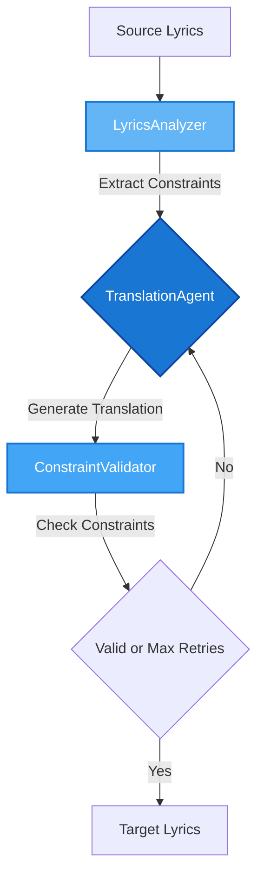

# 🥪 BLT - Better Lyrics Translation Toolkit

[](https://www.python.org/downloads/)
[](https://opensource.org/license/apache-2-0)

## Overview

**BLT** is a toolkit for song translation and voice synthesis. The toolkit contains three modular components that can be used independently or combined through pre-defined pipelines.

## Toolkit Components

### 1. Translator

**IPA-based lyrics translation tools with music constraints:**

| Tool                        | Description                                                           |
| --------------------------- | --------------------------------------------------------------------- |
| `LyricsTranslationAgent`    | Main translator with syllable/rhyme preservation                      |
| `SoramimiTranslationAgent`  | そらみみ (空耳) translator - creates text that sounds like the original |

**Music Constraints Extracted:**

1. **syllable_counts**: `list[int]` (ex. [4, 3])

   - Chinese: Character-based
   - Other languages: IPA vowel nuclei

2. **syllable_patterns**: `list[list[int]]` (ex. [[1, 1, 2], [1, 2]])

   - **With audio (WIP)**: Alignment problem - timing sync with vocals
   - **Without audio**: Word segmentation problem
     - Chinese: HanLP tokenizer
     - English: Space splitting
     - Other languages: LLM-based

3. **rhyme_scheme**: `str` (ex. AB)
   - Chinese: Pinyin finals
   - Other languages: IPA phonemes

4. **ipa_similarity**: `float` (ex. 0.5)
   - Phonetic similarity threshold for soramimi translation
   - Measured using IPA phoneme matching between source and target

<details open>
<summary><b>Translation Flow</b></summary>



</details>

### 2. (WIP) Synthesizer

TTS, alignment, and voice synthesis tools:

| Tool               | Description                              |
| ------------------ | ---------------------------------------- |
| `VocalSeparator`   | Separate vocals from instrumental tracks |
| `LyricsAligner`    | Align lyrics timing with audio           |
| `VoiceSynthesizer` | Synthesize vocals with new lyrics        |
| `RvcConverter`     | Convert voice using RVC models           |

### 3. (WIP) Pipeline

Pre-defined combinations of tools:

| Pipeline            | Description                                               |
| ------------------- | --------------------------------------------------------- |
| `CoverSongPipeline` | End-to-end pipeline for generating translated cover songs |

## Requirements

### System Requirements

- Python 3.11 or higher
- [espeak-ng](https://github.com/espeak-ng/espeak-ng) - Required for IPA phonetic analysis

### Optional Services

- **For LLM-based Translation:**
  - [Ollama](https://ollama.com/) - Local LLM inference
  - [Qwen3](https://github.com/QwenLM/Qwen3) model: `ollama pull qwen3:30b-a3b-instruct-2507-q4_K_M`

- **For Voice Conversion (RVC):**
  - Access to [r3gm/RVC_ZERO](https://huggingface.co/spaces/r3gm/RVC_ZERO) HuggingFace Space
  - RVC model files (.pth) and index files (.index)

## Setup

```bash
uv venv --python 3.11
source .venv/bin/activate
uv sync
```

## Usage

### Soramimi Translation (Phonetic Matching)

To generate soramimi lyrics that sound like the original, use the `examples/get_soramimi_lyrics.py` script:

```bash
uv run python examples/get_soramimi_lyrics.py
```

**Parameters:**

- `-f, --file`: Path to source lyrics file (default: `data/lyrics-let-it-go.txt`)
- `-s, --source`: Source language code (default: `en-us`)
- `-t, --target`: Target language code (default: `cmn` for Mandarin Chinese)
- `-m, --model`: Ollama model to use (default: `qwen3:30b-a3b-instruct-2507-q4_K_M`)
- `--threshold`: Phonetic similarity threshold 0-1 (default: `0.5`)
- `--save-dir`: Directory to save results (default: `outputs`)

## Acknowledgments

This project is built on top of excellent open-source libraries and tools:

### Core Libraries

- [PyTorch](https://pytorch.org/) - Deep learning framework
- [Pydantic AI](https://ai.pydantic.dev/) - LLM application framework
- [Demucs](https://github.com/facebookresearch/demucs) - Vocal separation (Facebook Research)
- [XTTS](https://github.com/coqui-ai/TTS) - Text-to-speech synthesis (Coqui AI)
- [HanLP](https://github.com/hankcs/HanLP) - Chinese NLP toolkit
- [Phonemizer](https://github.com/bootphon/phonemizer) - IPA phonetic transcription
- [ctc-forced-aligner](https://github.com/MahmoudAshraf97/ctc-forced-aligner) - Lyrics alignment
- [Panphon](https://github.com/dmort27/panphon) - Phonetic feature analysis
- [RVC](https://github.com/RVC-Project/Retrieval-based-Voice-Conversion-WebUI) via [r3gm/RVC_ZERO](https://huggingface.co/spaces/r3gm/RVC_ZERO) - Voice conversion

### Audio Processing

- [librosa](https://librosa.org/) - Audio analysis
- [Praat-Parselmouth](https://github.com/YannickJadoul/Parselmouth) - Acoustic analysis

### Language Models

- [Qwen3](https://github.com/QwenLM/Qwen3) - Open-source LLM for translation

## License

Apache License 2.0
