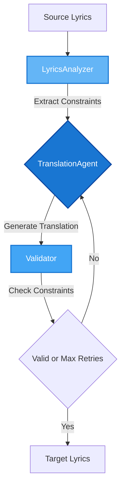

# 🥪 BLT - Better Lyrics Translation Toolkit

[](https://www.python.org/downloads/)
[](https://opensource.org/license/apache-2-0)

**BLT** is a toolkit for lyrics and singing voice. The toolkit contains three modular components that can be used independently or combined through pre-defined pipelines.

## Quick Start

```python
from blt.translators import SoramimiTranslationAgent

# Soramimi translation (phonetic matching)
agent = SoramimiTranslationAgent()
result = agent.translate(["Your lyrics here"])

print(result.soramimi_lines)  # Phonetically matched translation
```

## Components

### 1. Translator

**IPA-based lyrics translation tools with music constraints:**

| Tool                        | Description                                                           |
| --------------------------- | --------------------------------------------------------------------- |
| `LyricsTranslationAgent`    | Main translator with syllable/rhyme preservation                      |
| `SoramimiTranslationAgent`  | そらみみ (空耳) translator - creates text that sounds like the original |

**Music Constraints Extracted:**

1. **syllable_counts**: `list[int]` (ex. [4, 3])

   - Chinese: Character-based
   - Other languages: IPA vowel nuclei

2. **syllable_patterns**: `list[list[int]]` (ex. [[1, 1, 2], [1, 2]])

   - **With audio (WIP)**: Alignment problem - timing sync with vocals
   - **Without audio**: Word segmentation problem
     - Chinese: HanLP tokenizer
     - English: Space splitting
     - Other languages: LLM-based

3. **rhyme_scheme**: `str` (ex. AB)
   - Chinese: Pinyin finals
   - Other languages: IPA phonemes

4. **ipa_similarity**: `float` (ex. 0.5)
   - Phonetic similarity threshold for soramimi translation
   - Measured using IPA phoneme matching between source and target

<details open>
<summary><b>Translation Flow</b></summary>



</details>

### 2. Synthesizer (WIP)

| Tool               | Description                                         |
| ------------------ | --------------------------------------------------- |
| `VocalSeparator`   | Vocal / instrumental separation                     |
| `VoiceConverter`   | Voice conversion (RVC)                              |
| `LyricsAligner`    | Timing alignment                                    |
| `AudioMixer`       | Audio mixing with automatic resampling              |
| `VideoGenerator`   | Video generation (KTV, Lip-Synced)                  | 

### 3. Pipeline (WIP)

| Pipeline            | Description                   |
| ------------------- | ----------------------------- |
| `CoverSongPipeline` | End-to-end translated covers  |

## Requirements

- Python 3.11+
- [espeak-ng](https://github.com/espeak-ng/espeak-ng) (IPA analysis)
- [Ollama](https://ollama.com/) + [Qwen3](https://github.com/QwenLM/Qwen3): `ollama pull qwen3:30b-a3b-instruct-2507-q4_K_M`
- (Optional) [LangSmith](https://smith.langchain.com/) API key for tracing/monitoring
- (Optional) [RVC_ZERO](https://huggingface.co/spaces/r3gm/RVC_ZERO) for voice conversion

## Setup

```bash
uv venv --python 3.11
source .venv/bin/activate
uv sync
```

## Acknowledgments

Built with: [LangGraph](https://langchain-ai.github.io/langgraph/), [LangChain](https://www.langchain.com/), [Ollama](https://ollama.com/), [PyTorch](https://pytorch.org/), [Pydantic AI](https://ai.pydantic.dev/), [Demucs](https://github.com/facebookresearch/demucs), [XTTS](https://github.com/coqui-ai/TTS), [HanLP](https://github.com/hankcs/HanLP), [Phonemizer](https://github.com/bootphon/phonemizer), [ctc-forced-aligner](https://github.com/MahmoudAshraf97/ctc-forced-aligner), [Panphon](https://github.com/dmort27/panphon), [RVC](https://github.com/RVC-Project/Retrieval-based-Voice-Conversion-WebUI), [Qwen3](https://github.com/QwenLM/Qwen3)

## License

Apache License 2.0
