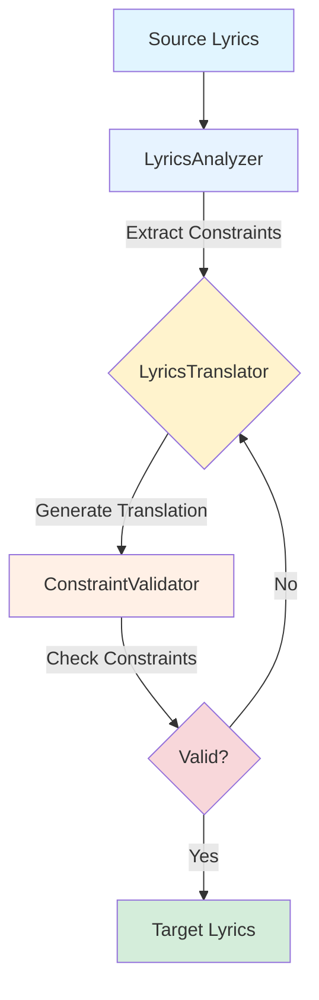

# 🥪 BLT - Better Lyrics Translation Toolkit

[](https://www.python.org/downloads/)
[](https://opensource.org/license/apache-2-0)

## Overview

**BLT** is a toolkit for song translation and voice synthesis. The toolkit contains three modular components that can be used independently or combined through pre-defined pipelines.

## Toolkit Components

### 1. Translator

<table>
<tr>
<td width="50%" valign="top">

**IPA-based lyrics translation tools with music constraints:**

| Tool                  | Description                                          |
| --------------------- | ---------------------------------------------------- |
| `LyricsTranslator`    | Main translator with syllable/rhyme preservation     |
| `LyricsAnalyzer`      | Extract music constraints from lyrics                |
| `ConstraintValidator` | Validate translated lyrics against music constraints |

**Music Constraints Extracted:**

1. **Syllable Counts** (per line)

   - IPA-based syllable counting for English
   - Character-based counting for Chinese
   - Multi-language support (Japanese, Korean, etc.)

2. **Rhyme Scheme** (e.g., AABB, ABAB)

   - IPA phoneme-based rhyme detection for English
   - Pinyin finals (韻母) for Chinese
   - Cross-line rhyme pattern analysis

3. **Syllable Patterns** (word-level)
   - Syllables per word within each line
   - Example: "I love you" → [1, 1, 1]
   - Preserves singing rhythm and phrasing

</td>
<td width="50%" valign="top">

**Translation Flow:**



</td>
</tr>
</table>

### 2. Synthesizer

TTS, alignment, and voice synthesis tools:

| Tool               | Description                              |
| ------------------ | ---------------------------------------- |
| `VocalSeparator`   | Separate vocals from instrumental tracks |
| `LyricsAligner`    | Align lyrics timing with audio           |
| `VoiceSynthesizer` | Synthesize vocals with new lyrics        |

### 3. Pipeline

Pre-defined combinations of tools:

| Pipeline            | Description                                               |
| ------------------- | --------------------------------------------------------- |
| `CoverSongPipeline` | End-to-end pipeline for generating translated cover songs |

## Setup

```bash
uv venv --python 3.11
source .venv/bin/activate
uv sync
```

## Usage

To generate a translated cover song, use the `examples/gen_translated_song.py` script:

```bash
uv run python examples/gen_translated_song.py \
    --audio "path/to/your/song.mp3" \
    --old-lyrics-file "path/to/original/lyrics.txt" \
    --new-lyrics-file "path/to/new/lyrics.txt" \
    --output-name "my_cover_song"
```

**Parameters:**

- `--audio`: Path to the original song audio file.
- `--old-lyrics-file`: Path to a text file containing the original lyrics.
- `--new-lyrics-file`: Path to a text file containing the new lyrics.
- `--output-name`: The name for the generated cover song files.
- `--device`: The device to run the models on (`cuda` or `cpu`).

## Acknowledgments

- [Demucs](https://github.com/facebookresearch/demucs) by Facebook Research
- [XTTS](https://github.com/coqui-ai/TTS) by Coqui AI

## License

Apache License 2.0
